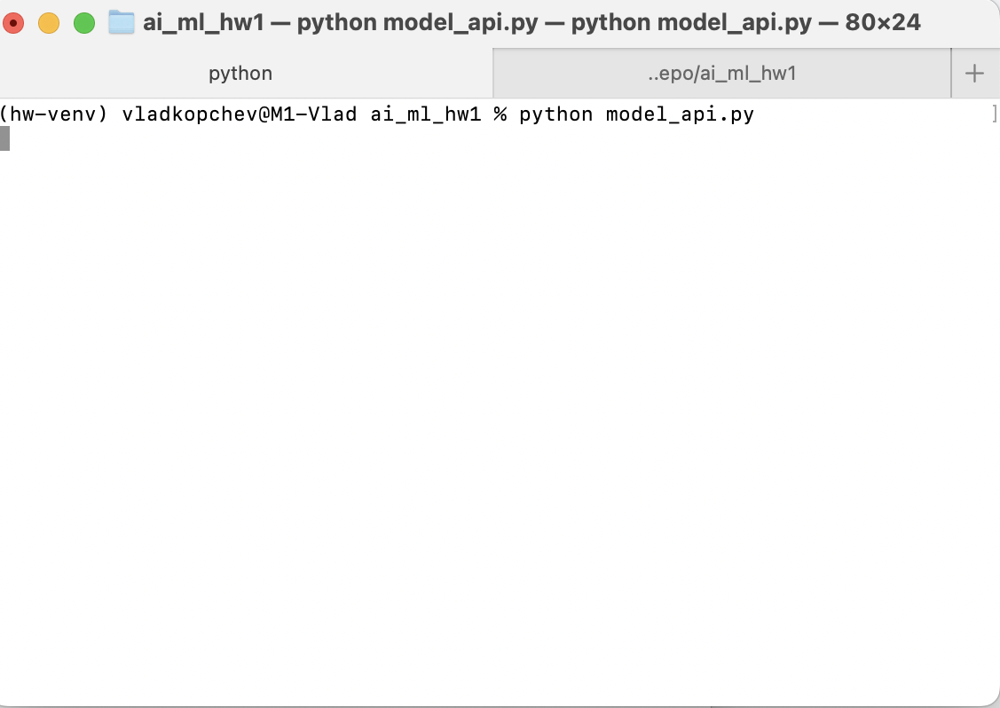
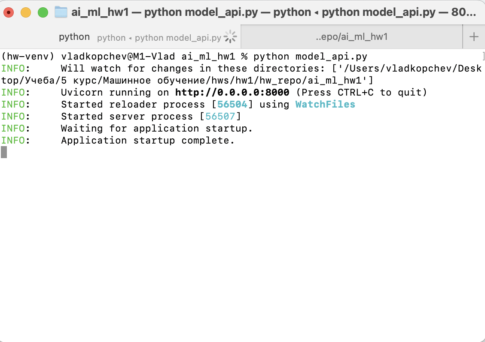
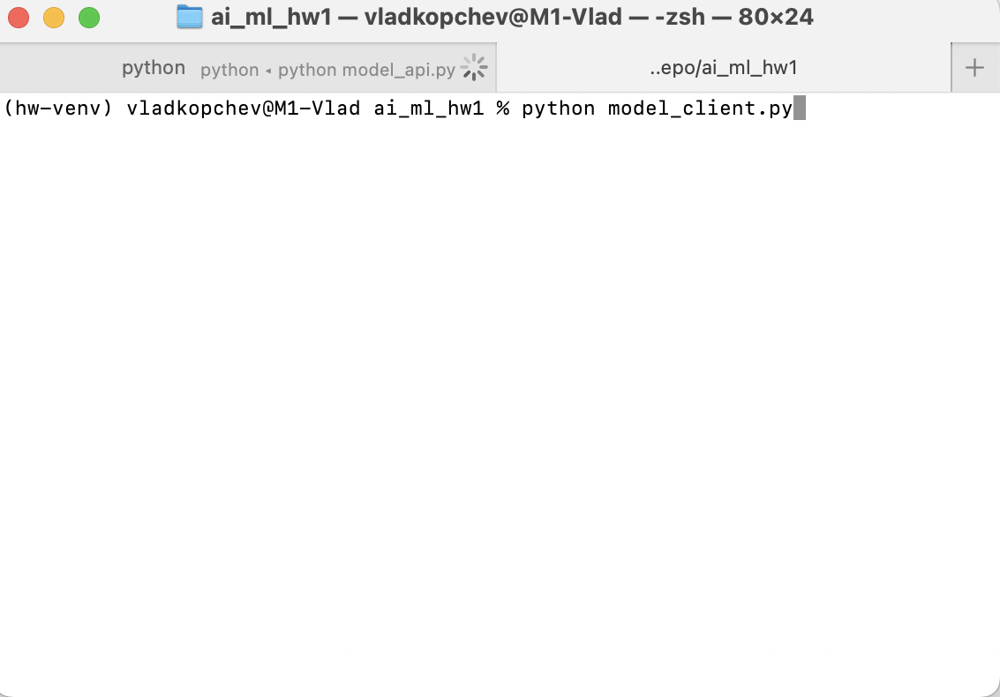
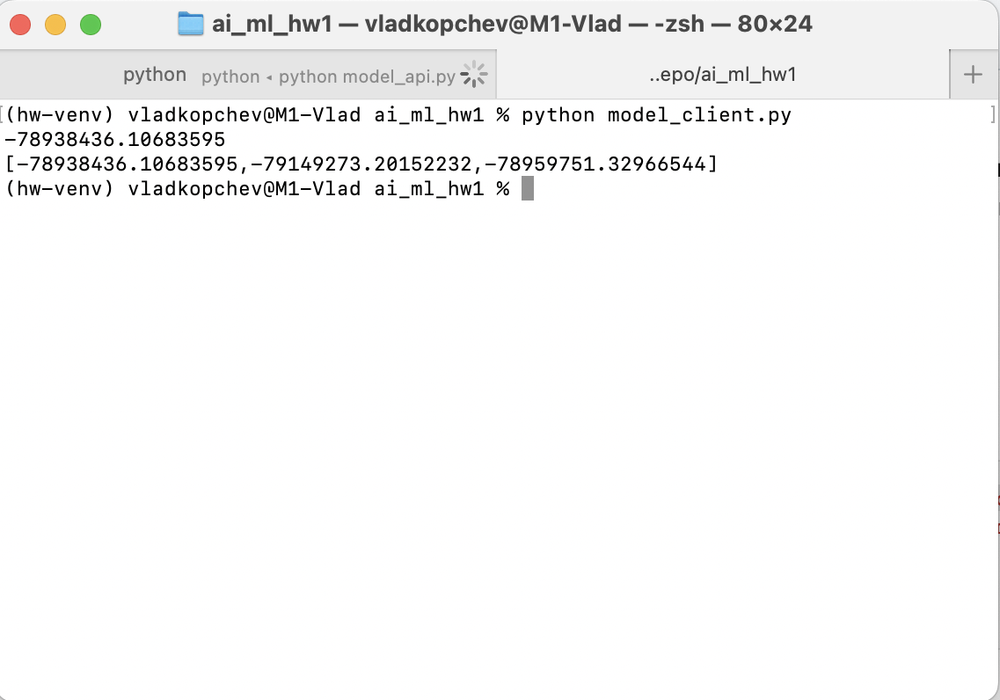

### Домашнее задание 1

**Что было сделано?**

В работе были выполнены все пункты, не хватило времени только на осмысленный feature engineering. А именно:
- Произведен EDA (корреляции, основные статистики, распределения)
- Произведен preprocessing: заполнение медианы, преобразование неструктурированного текста в числовые и категорийные фичи, удаление дубликатов
- Обучена линейная регрессия на вещественных признаков и scaled вещественных признаках, а также Lasso и ElasticNet на scaled вещественных
- Предобработаны категорийные фичи и обучена Ridge на категорийных
- Реализованы L\_0-регрессия, R^2, adjusted-R^2, корреляция Спирмена, бизнес-метрика.

**С какими результатами?**

Даже при оптимизации гиперпараметров все модели на вещественных признаках давали R^2 около 0.5. Только добавление категорийных фичей дало по-настоящему хороший рост.

**Что дало наибольший буст?**

Наибольший буст дало добавление категорийных фичей с Ridge-регрессией. Метрика R^2 увеличилась более чем в 1.5 раза.

**Что не получилось?**

К сожалению, не успел лучше поэкспериментировать с инжинирингом фичей из-за времени.

**Реализация сервиса**

Также в задании был реализован сервис: мы можем передать данные в модель и полуичить результат. Для этого в файлы `encoder.pkl`, `medians.pkl`, `model.pkl`, `scaler.pkl` были загружены обученные на `df_train` `OneHotEncoder`, медианы на трейне для заполнения пропусков, модель, обученная на вещественных и категориальных признаках, и `StandardScaler` из ноутбука.

В файле `model_api.py` были реализованы методы `API` для работы с моделью на основе `FastAPI`. Скрипт `model_client.py` содержит примеры обращения к обоим методам API. Файл `data_transform.py` содержит трансформации поступающих на вход модели данных, которые необходимы для работы `model_api.py`. 

**Демонстрация работы сервиса**

Сначала запускаем `model_api.py`:

Теперь передаем запросы с помощью `model_client.py`:

Видим успешное выполнение обоих запросов.
